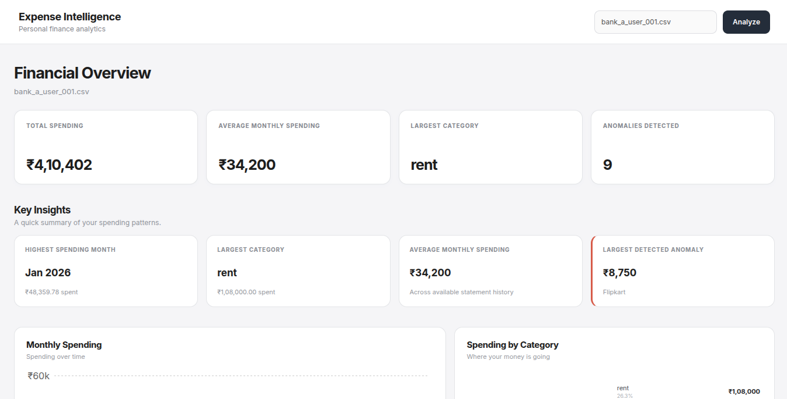
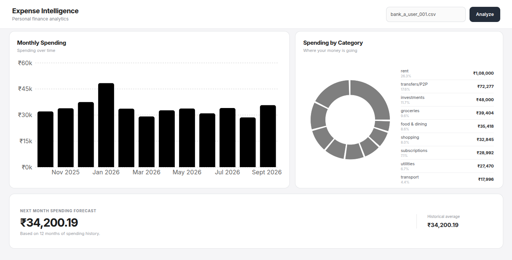
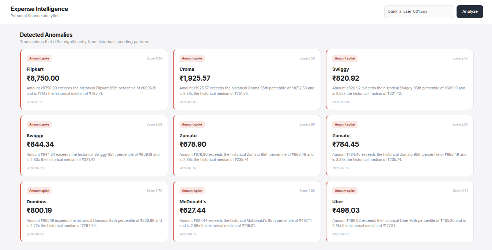
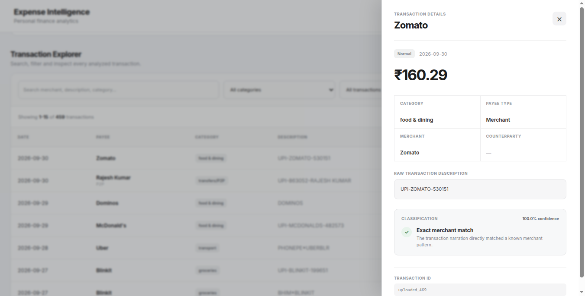
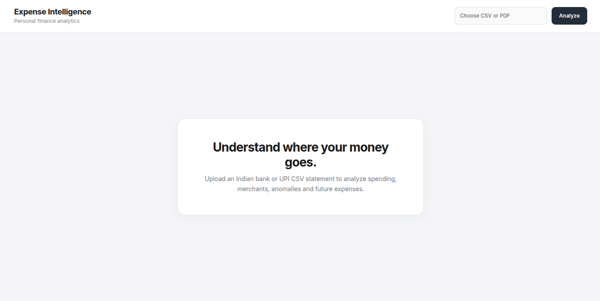

# Personal Finance Intelligence

A full-stack personal finance intelligence platform for analyzing Indian bank and UPI statements.

Upload a CSV or PDF statement and the application extracts transactions, cleans messy merchant descriptions, identifies merchants and P2P counterparties, categorizes spending, detects unusual spending patterns, and forecasts future spending.

Built with **Python, FastAPI, React, and Vite**.


> **Privacy:** The application processes uploaded statements temporarily and does not permanently store uploaded financial statements. The repository contains only synthetic/anonymized sample data.

---

## What it does

```text
Bank / UPI Statement
        ↓
CSV / PDF Ingestion
        ↓
Transaction Normalization
        ↓
Merchant & Counterparty Resolution
        ↓
Spending Categorization
        ↓
Anomaly Detection
        ↓
Spending Forecast
        ↓
Interactive Dashboard
```

---

## Screenshots

### Dashboard



### Category Analysis



### Anomaly Detection



### Transaction Detail



### Upload & Analysis



---

## Features

### Statement Ingestion

- CSV statement ingestion
- PDF statement ingestion
- Automatic CSV format detection
- Support for multiple Indian bank statement layouts
- Handles metadata and header rows appearing before transaction tables
- Handles footer rows and non-transaction content
- Normalizes dates, amounts, debit/credit fields, balances, and transaction types

### Merchant & Counterparty Resolution

The application distinguishes between:

- **Merchants** — businesses where money is spent
- **P2P counterparties** — people involved in transfers

This prevents a transfer to another person from being incorrectly treated as a merchant purchase.

Merchant resolution supports:

- Exact merchant matching
- Fuzzy matching
- Merchant dictionaries
- Merchant clustering
- Noisy UPI/payment-provider descriptions
- Canonical merchant IDs

### Spending Categorization

The categorization pipeline uses a hybrid approach:

1. User overrides
2. Exact merchant matching
3. Fuzzy merchant matching
4. Counterparty detection
5. Machine-learning classification
6. Unresolved fallback

The ML classifier uses:

- Character-level TF-IDF features
- Logistic Regression
- Confidence thresholds
- Generalization testing on unseen merchant descriptions

### Anomaly Detection

The system detects unusual spending using:

- Merchant-level spending baselines
- Category-level baselines
- Historical spending behavior
- Robust statistical thresholds
- Median and percentile-based comparisons
- Category spending spikes
- Large one-off purchases
- Unusual purchases
- Recurring-payment exclusions
- P2P exclusions where appropriate

Anomaly results include explanations rather than simply returning a binary anomaly flag.

### Recurring Payment Detection

The system identifies potentially recurring payments using:

- Merchant history
- Transaction frequency
- Date intervals
- Amount similarity

Recurring transactions can be excluded from anomaly detection where appropriate.

### Spending Forecast

The application estimates future spending using historical transaction data.

Current forecasting approaches include:

- Cumulative historical average
- Recent-window baseline

The evaluation pipeline compares forecasting approaches using MAE.

### Duplicate Detection

The ingestion pipeline can identify potential duplicate transactions using:

- Bank reference numbers
- Transaction dates
- Descriptions
- Debit amounts
- Credit amounts

Duplicates are flagged rather than silently removed.

This preserves the original transaction dataset while allowing downstream components to decide how duplicates should be handled.

### Interactive Dashboard

The React frontend provides:

- Spending overview
- Category analysis
- Forecasts
- Anomaly filtering
- Transaction search
- Category filtering
- Transaction sorting
- Pagination
- Transaction detail views
- CSV upload
- PDF upload
- Loading and error states

---

## Architecture

```text
                           ┌─────────────────────┐
                           │   CSV / PDF Upload  │
                           └──────────┬──────────┘
                                      │
                                      ▼
                           ┌─────────────────────┐
                           │ Statement Ingestion │
                           │  CSV / PDF Parsing  │
                           └──────────┬──────────┘
                                      │
                                      ▼
                           ┌─────────────────────┐
                           │    Normalization    │
                           │ Dates / Amounts /   │
                           │ Debit / Credit      │
                           └──────────┬──────────┘
                                      │
                                      ▼
                       ┌────────────────────────────┐
                       │ Merchant / Counterparty    │
                       │ Resolution & Deduplication │
                       └──────────────┬─────────────┘
                                      │
                                      ▼
                           ┌─────────────────────┐
                           │   Categorization    │
                           │ Rules + ML + Fuzzy  │
                           └──────────┬──────────┘
                                      │
                         ┌────────────┴────────────┐
                         ▼                         ▼
                ┌─────────────────┐       ┌─────────────────┐
                │ Anomaly Engine  │       │ Forecast Engine │
                └────────┬────────┘       └────────┬────────┘
                         │                         │
                         └────────────┬────────────┘
                                      ▼
                           ┌─────────────────────┐
                           │      FastAPI        │
                           │       Backend       │
                           └──────────┬──────────┘
                                      │
                                      ▼
                           ┌─────────────────────┐
                           │    React + Vite     │
                           │     Dashboard       │
                           └─────────────────────┘
```

---

## Tech Stack

### Backend

- Python
- FastAPI
- Pandas
- Scikit-learn
- RapidFuzz
- ReportLab
- PyMuPDF

### Machine Learning

- TF-IDF
- Logistic Regression
- Rule-based classification
- Fuzzy matching
- Merchant clustering
- Robust statistical anomaly detection

### Frontend

- React
- Vite
- Recharts
- JavaScript
- CSS

### Testing

- Pytest
- Backend API tests
- Unit tests
- Pipeline tests
- Classification evaluation
- Anomaly evaluation
- Forecast evaluation
- Generalization evaluation

---


## Project Structure

```text
personal-finance-intelligence/
│
├── app.py
├── README.md
├── requirements.txt
├── .gitignore
│
├── anomaly/
│   ├── __init__.py
│   ├── baseline.py
│   ├── category_spending.py
│   ├── flagging.py
│   └── recurring.py
│
├── backend/
│   ├── __init__.py
│   └── main.py
│
├── categorization/
│   ├── __init__.py
│   ├── cleaning.py
│   ├── counterparty.py
│   ├── merchant_clustering.py
│   ├── merchant_dictionary.py
│   ├── ml_classifier.py
│   ├── overrides.py
│   └── rule_based.py
│
├── data/
│   ├── __init__.py
│   ├── deduplication.py
│   ├── ingestion.py
│   ├── pdf_ingestion.py
│   ├── schemas.py
│   ├── synthetic_generator.py
│   │
│   └── sample/
│       ├── bank_a_user_001.csv
│       ├── bank_b_user_001.csv
│       ├── bank_c_user_001.csv
│       ├── synthetic_12_month_statement.csv
│       ├── synthetic_12_month_statement.pdf
│       └── test_bank_statement.pdf
│
├── evaluation/
│   ├── diagnose_category_anomalies.py
│   ├── evaluate_anomalies.py
│   ├── evaluate_classifier.py
│   ├── evaluate_clustering.py
│   ├── evaluate_forecast.py
│   ├── evaluate_hybrid.py
│   ├── evaluate_ml.py
│   ├── evaluate_ml_confidence.py
│   ├── evaluate_ml_generalization.py
│   ├── evaluate_pipeline.py
│   ├── evaluate_rule_based.py
│   ├── generalization_dataset.py
│   ├── inspect_false_positives.py
│   ├── ml_dataset.py
│   └── test_category_thresholds.py
│
├── forecasting/
│   ├── __init__.py
│   └── forecast.py
│
├── frontend/
│   ├── index.html
│   ├── package.json
│   ├── package-lock.json
│   ├── README.md
│   ├── vite.config.js
│   ├── public/
│   │   ├── favicon.svg
│   │   └── icons.svg
│   │
│   └── src/
│       ├── App.jsx
│       ├── App.css
│       ├── index.css
│       └── main.jsx
│
├── tests/
│   ├── __init__.py
│   ├── test_anomalies.py
│   ├── test_backend.py
│   ├── test_categorization.py
│   ├── test_category_spending.py
│   ├── test_cleaning.py
│   ├── test_counterparty_extraction.py
│   ├── test_deduplication.py
│   ├── test_forecast.py
│   ├── test_ingestion.py
│   ├── test_pdf_ingestion.py
│   ├── test_pipeline.py
│   └── test_recurring.py
│
└── models/
    └── .gitkeep
```

---

## Installation

Clone the repository:

```bash
git clone https://github.com/abhiminav/personal-finance-intelligence.git
cd personal-finance-intelligence
```

### Create a virtual environment

```bash
python -m venv .venv
```

Activate it on Linux/macOS:

```bash
source .venv/bin/activate
```

On Windows:

```powershell
.venv\Scripts\activate
```

### Install Python dependencies

```bash
pip install -r requirements.txt
```

### Install frontend dependencies

```bash
cd frontend
npm install
cd ..
```

---

## Running the Application

The application consists of a FastAPI backend and a React frontend.

### Start the backend

From the project root:

```bash
uvicorn backend.main:app --reload
```

The backend runs by default at:

```text
http://127.0.0.1:8000
```

FastAPI documentation is available at:

```text
http://127.0.0.1:8000/docs
```

### Start the frontend

Open another terminal:

```bash
cd frontend
npm run dev
```

The frontend runs by default at:

```text
http://localhost:5173
```

---

## Supported Statement Formats

The ingestion layer currently supports three CSV layouts.

### Bank A

```text
Date
Description
Debit
Credit
Balance
```

### Bank B

```text
Txn Date
Value Date
Narration
Withdrawal Amt
Deposit Amt
Closing Balance
```

### Bank C

Bank C exports may contain account metadata before the transaction table and duplicate `Dr / Cr` columns.

```text
Sl. No.
Transaction Date
Value Date
Description
Chq /Ref No.
Amount
Dr / Cr
Balance
```

The ingestion layer detects the transaction header automatically and ignores non-transaction footer rows.

### PDF Statements

PDF statements are parsed into the same normalized transaction representation used by CSV ingestion.

The repository includes synthetic PDF fixtures for testing PDF extraction without exposing real financial information.

---

## Example Transaction Classification

A messy UPI description such as:

```text
UPI/DR/123456789012/SWIGGY/OKAXIS
```

is cleaned into a normalized representation and resolved to the canonical merchant:

```text
Swiggy
```

which is then categorized as:

```text
food & dining
```

Similarly:

```text
UPI/DR/987654321234/RAJESH KUMAR/YBL
```

can be resolved as a P2P counterparty rather than incorrectly classified as a merchant.

---

## Synthetic Dataset

The repository includes a synthetic 12-month transaction dataset designed to simulate realistic Indian personal-finance activity.

### Dataset characteristics

```text
Users:             5
Transactions:      2,393
History:           12 months
Period:            Oct 2025 – Sep 2026
Random seed:       42
```

The generator includes:

- Salary credits
- Rent
- Groceries
- Dining
- Shopping
- Transport
- Utilities
- Subscriptions
- Investments
- P2P transfers
- Everyday UPI payments
- Messy merchant descriptions
- Payment-provider noise
- Recurring transactions

Synthetic anomalies include:

- Large one-off purchases
- Category spending spikes
- Unusual purchases

The synthetic dataset is intended for development and evaluation and should not be interpreted as representative of real customer spending behavior.

---


## Evaluation

The project includes automated tests and separate evaluation scripts for the major components.

Current full test suite:

```text
166 passed
1 warning
```

The evaluation framework covers:

- CSV ingestion
- PDF ingestion
- Description cleaning
- Merchant resolution
- Counterparty extraction
- Rule-based categorization
- ML categorization
- Hybrid categorization
- Merchant clustering
- Duplicate detection
- Anomaly detection
- Category spending anomalies
- Recurring transaction detection
- Forecasting
- End-to-end pipeline behavior
- Backend API behavior

Run the complete test suite with:

```bash
pytest -q
```

---

## Classification Evaluation

The ML classifier uses character-level TF-IDF features followed by Logistic Regression.

A generalization benchmark was also created using unseen/noisy merchant descriptions.

The ML-only benchmark achieved:

```text
Accuracy:       82.14%
Macro F1:       0.71
Weighted F1:    0.77
```

The production classifier uses a hybrid strategy rather than relying entirely on the ML model.

The hybrid classification pipeline prioritizes deterministic information when available and falls back to ML for unresolved descriptions.

---

## Merchant Clustering

Merchant clustering is used to group noisy transaction descriptions that likely refer to the same underlying merchant.

The benchmark currently covers:

```text
Transactions:   2,393
Clusters:       65
Resolved:       65
Unresolved:     0
```

Clustering is used as a supporting signal rather than as the sole source of merchant identity.

---

## Anomaly Detection

The anomaly engine combines historical behavior with statistical thresholds.

### Merchant-level detection

Merchant-level baselines consider:

- Historical transaction count
- Historical median spending
- High-percentile spending thresholds
- Amount ratios
- Merchant history requirements

The merchant baseline is preferred when enough historical information exists.

### Category-level detection

Category spending is evaluated over time using historical monthly spending.

The system uses:

- Prior-month historical baselines
- Robust z-scores
- Median absolute deviation
- Minimum history requirements
- Minimum spending increase thresholds

### Special handling

The anomaly system avoids treating every unusual transaction as suspicious.

Examples of exclusions include:

- P2P transfers
- Recurring payments
- Transactions without sufficient historical context

The system also distinguishes between:

```text
No anomaly
Possible anomaly
Confirmed/strong anomaly signal
Insufficient history
```

depending on the available evidence.

---

## Forecasting

The forecasting module estimates future spending from historical transaction behavior.

The current production baseline uses cumulative historical spending averages.

A recent-window approach is also implemented for comparison.

Evaluation is performed using Mean Absolute Error (MAE).

Example benchmark:

```text
Cumulative historical average MAE:  ₹5,693.31
3-month rolling average MAE:        ₹6,347.67
```

The forecast should be interpreted as a baseline estimate rather than a precise prediction of future spending.

Forecast accuracy depends strongly on the amount of historical transaction data available.

---

## End-to-End Pipeline

The complete pipeline follows:

```text
Input Transactions
        ↓
Validation
        ↓
Duplicate Detection
        ↓
Merchant / Counterparty Resolution
        ↓
Categorization
        ↓
Category Baselines
        ↓
Merchant Baselines
        ↓
Anomaly Detection
        ↓
Spending Forecast
        ↓
API Response
        ↓
React Dashboard
```

The pipeline preserves the input transaction count while attaching analytical metadata to transactions.

---

## API

The FastAPI backend exposes endpoints for:

- Health checks
- File uploads
- Transaction analysis
- Spending summaries
- Category spending
- Monthly spending
- Recent transactions
- Anomaly results
- Forecast results
- Transaction records
- Generated insights

Interactive API documentation is available at:

```text
http://127.0.0.1:8000/docs
```

---

## Data Privacy

Financial statements can contain highly sensitive information.

This project is designed so uploaded statements are processed temporarily during analysis rather than being permanently stored by the application.

The repository does not intentionally contain real bank statements or real customer financial data.

Sample statements are synthetic or sanitized for development and testing.

For production deployment, additional controls would be required, including:

- Authentication
- Authorization
- HTTPS
- Secure file handling
- Rate limiting
- Audit logging
- Secure temporary storage
- Data retention policies
- Encryption
- Secret management
- Stronger isolation between users

---

## Limitations

This is a portfolio/research project rather than a production banking application.

Important limitations include:

- Synthetic data is used for the primary evaluation dataset.
- Merchant classification quality depends on the available merchant history and training examples.
- New merchants may require additional historical data before reliable classification is possible.
- Anomaly detection can produce false positives when historical behavior is limited.
- Forecast accuracy depends on the amount and stability of historical spending data.
- PDF extraction quality depends on the structure and formatting of the source statement.
- Bank statement layouts vary significantly across financial institutions.
- Real-world deployment would require substantially stronger security and privacy controls.

---

## Future Improvements

Potential next steps include:

- More bank statement formats
- Better PDF table extraction
- User-specific model adaptation
- Online learning from user corrections
- Improved merchant entity resolution
- Better anomaly explanations
- More robust forecasting models
- Personalized spending recommendations
- Recurring expense calendars
- Budget planning
- Multi-user authentication
- Persistent user profiles
- Secure production deployment
- Database-backed storage
- Automated model evaluation and retraining

---


## Project Status

The current implementation provides an end-to-end working system covering:

```text
CSV ingestion              ✓
PDF ingestion              ✓
Transaction normalization  ✓
Merchant resolution        ✓
Counterparty resolution    ✓
Hybrid categorization      ✓
Merchant clustering        ✓
Duplicate detection        ✓
Anomaly detection          ✓
Recurring detection        ✓
Spending forecasting       ✓
FastAPI backend             ✓
React frontend              ✓
Automated testing           ✓
Evaluation pipeline         ✓
```

The project is structured as a portfolio-grade data/ML engineering application, with an emphasis on reproducibility, testing, explainability, and realistic financial transaction data.

---

## License

This project is intended for educational and portfolio purposes.
